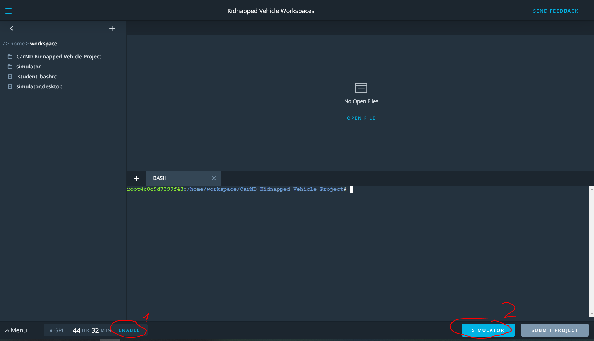
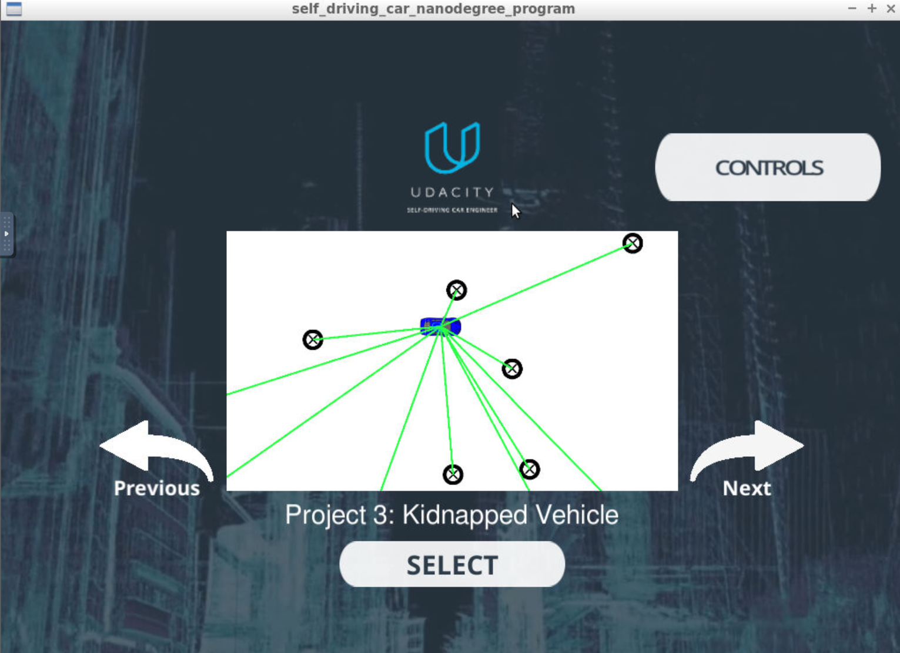

# Overview
This repository contains all the code needed to complete the final project for the Localization course in Udacity's Self-Driving Car Nanodegree.

## Project Introduction
My robot has been kidnapped and transported to a new location! Luckily it has a map of this location, a (noisy) GPS estimate of its initial location, and lots of (noisy) sensor and control data.
>
In this project I implemented a 2 dimensional particle filter in C++. 

## Building & Running the Code

Use the UDACITY provided scripts to build and run the filter:

1.  cd CarND-Kidnapped-Vehicle-Project
2. ./install-ubuntu.sh
3. ./clean.sh
4. ./build.sh
5. ./run.sh


## Implementing the Particle Filter
The directory structure of this repository is as follows:

```
CarND-Kidnapped-Vehicle-Project
|   build.sh
|   clean.sh
|   CMakeLists.txt
|   README.md
|   run.sh
|
|___data
|   |   
|   |   map_data.txt
|   
|   
|___src
    |   helper_functions.h
    |   main.cpp
    |   map.h
    |   particle_filter.cpp
    |   particle_filter.h
```

The particle filter is implemented using the files `particle_filter.cpp` and `particle_filter.h` in the src subdirctory.


## Running the Particle-Filter

If you are working with the Udaycity Workspace:
- ensure that GPU mode is enabled (1)
- start the Simumaltor Environment by clicking on [Simulator] button (2)


- within the Simulator Window Click on [Simulator] 
- when the Simulator Windows opens select the right simulator and hit start
